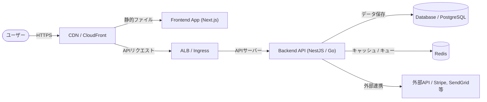
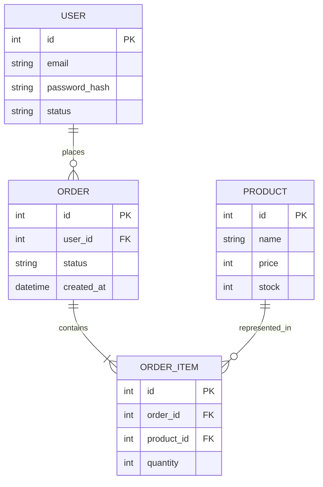

# 🏗️ プロダクト & アーキテクチャ解説

このドキュメントでは、プロダクトのビジネス概要とシステムの全体像、採用している技術スタックについて解説します。

---

## 💡 1. プロダクト概要

### プロダクトの目的
- **[要記入: プロダクト名]** は、**[要記入: 主要なターゲットユーザー（例: 一般ユーザー、企業担当者）]** に向けて、**[要記入: 提供するメイン価値・解決する課題]** を提供するサービスです。

### 主要な機能
1. **[機能1]**: [機能の簡単な説明]
2. **[機能2]**: [機能の簡単な説明]
3. **[機能3]**: [機能の簡単な説明]

---

## 🌐 2. システム構成図 (Architecture)

プロダクトは、以下のような構成で構築されています。

- **フロントエンド**: [Next.js / React] を使用し、[Vercel / AWS Amplify / ECS] にホストされています。
- **バックエンド**: [NestJS / Go / Express] で構築されたAPIサーバーが、[ECS / EKS / GKE] で動作しています。
- **データベース**: メインの永続化層として [PostgreSQL / MySQL] を使用しています。

---

## 🛠️ 3. 技術スタック (Tech Stack)

| レイヤー | 使用技術 | バージョン / 詳細 | 備考 |
| :--- | :--- | :--- | :--- |
| **Frontend** | React, Next.js, TypeScript | `v[要記入]`, `v[要記入]` | [主要ライブラリなど] |
| **Backend** | TypeScript, NestJS, Prisma | `v[要記入]` | APIデザインはREST/GraphQL |
| **Database** | PostgreSQL | `v[要記入]` | 開発・検証用はAWS RDSで起動 |
| **Cache / Queue** | Redis | `v[要記入]` | セッション管理と非同期ジョブ用 |
| **Infrastructure** | AWS (ECS, RDS, S3, CloudFront) | Terraformによるコード管理 | 本番環境はマルチAZ構成 |
| **CI / CD** | GitHub Actions | 静的解析、ユニットテスト、デプロイ | `.github/workflows/` に定義 |
| **Monitoring** | Datadog, Sentry | ログ監視、エラー追跡、APM | [ダッシュボードURLなど] |

---

## 🗄️ 4. 主要なデータモデル & ドメイン概念

主要なデータベーステーブルおよびドメインオブジェクトの関係性（概念）は以下の通りです。

> [!NOTE]
> - データベースの詳細なスキーマ定義やマイグレーションファイルは、リポジトリの `[要記入: スキーマ定義パス、例: prisma/schema.prisma や db/schema.sql]` を参照してください。
> - 開発環境でのダンプデータの投入手順は [setup.md](setup.md#データベースやバックエンドサービスの起動) を参照してください。
