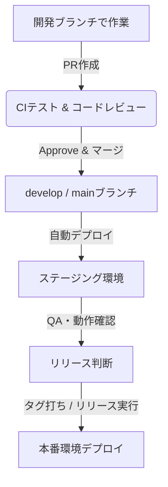

# 🔄 開発プロセス & チームルール

このドキュメントでは、チームでの開発サイクル、Gitルール、コードレビュー、リリースフローについて説明します。

---

## 🌿 1. Git & GitHub ルール

チームでは主に **[GitHub Flow / Git Flow / Trunk-based Development]** を採用しています。

### ブランチ作成ルール
- ブランチは `main` (または `develop`) から作成します。
- ブランチ名の命名規則:
  - 新機能: `feature/[チケット番号]_[簡単な英語の説明]` (例: `feature/TICKET-123_add-login`)
  - バグ修正: `bugfix/[チケット番号]_[簡単な英語の説明]` (例: `bugfix/TICKET-456_fix-signup-validation`)
  - ドキュメントやリファクタ: `docs/...` や `refactor/...`

### コミットルール
- コミットは意味のある最小単位で行ってください。
- コミットメッセージの推奨ルール (Conventional Commitsに準拠):
  - `feat: [チケット番号] [メッセージ]` (新機能)
  - `fix: [チケット番号] [メッセージ]` (バグ修正)
  - `docs: [メッセージ]` (ドキュメント変更)

---

## 🔍 2. コードレビュー & プルリクエスト (PR)

### PRの作成手順
1. ブランチをリモートにプッシュし、GitHub上でPRを作成します。
2. PRテンプレートに従って、概要・変更点・確認手順を記載します。
3. 自動テスト（GitHub Actions等）がパスすることを確認します。

### レビューと承認 (Approve)
- **レビュアーの指定**: PR作成時、チームのSlackチャンネル `[要記入: チャンネル名]` または自動アサインによってレビュアーを依頼します。
- **Approve基準**: マージには最低 **[1名 / 2名]** のエンジニアによる Approve が必要です。
- **指摘への対応**: レビューでのコメントに対応したら、再レビューを依頼（Review Request）してください。

### マージ
- すべてのCIテストがパスし、必要なApproveを得られたら、**[PRの作成者自身 / レビュアー]** が `Squash and merge` (または通常マージ) を行います。

---

## 🚀 3. デプロイ & リリースフロー

開発したコードがユーザーに届くまでの流れです。

- **ステージング環境**: `develop` / `main` にマージされると、GitHub Actionsによりステージング環境 `[要記入: ステージングURL]` へ自動デプロイされます。
- **本番リリース**: 週に **[要記入: リリース頻度、例: 毎週火曜日]** にリリースを行います。リリースの手順書は [要記入: リリース手順書のConfluenceリンク等] を参照してください。

---

## 📅 4. チームの定例会議 (セレモニー)

チームではアジャイル/スクラム開発を意識した以下の会議体を行っています。

| 会議名 | 頻度・曜日 | 時間 | 目的・内容 |
| :--- | :--- | :--- | :--- |
| **デイリースタンドアップ (朝会)** | 毎日 (月〜金) | 10:00 - 10:15 | 昨日やったこと、今日やること、ブロック（困りごと）の共有 |
| **スプリントプランニング** | 週1回 (毎週月曜) | 11:00 - 12:00 | 今週取り組むタスク（スプリントバックログ）の選定と見積もり |
| **スプリントレトロスペクティブ (ふりかえり)** | 週1回 (毎週金曜) | 17:00 - 18:00 | KPT等のフレームワークを用いたスプリントの振り返りと改善案出し |
| **バックログリファインメント** | 隔週 | 14:00 - 15:00 | 将来のタスク（ストーリー）の要件整理と優先順位の調整 |

> [!TIP]
> 各会議の参加用Zoom/Meetのリンクやカレンダー招待は、Google カレンダーの `[要記入: カレンダー名]` に登録されています。
