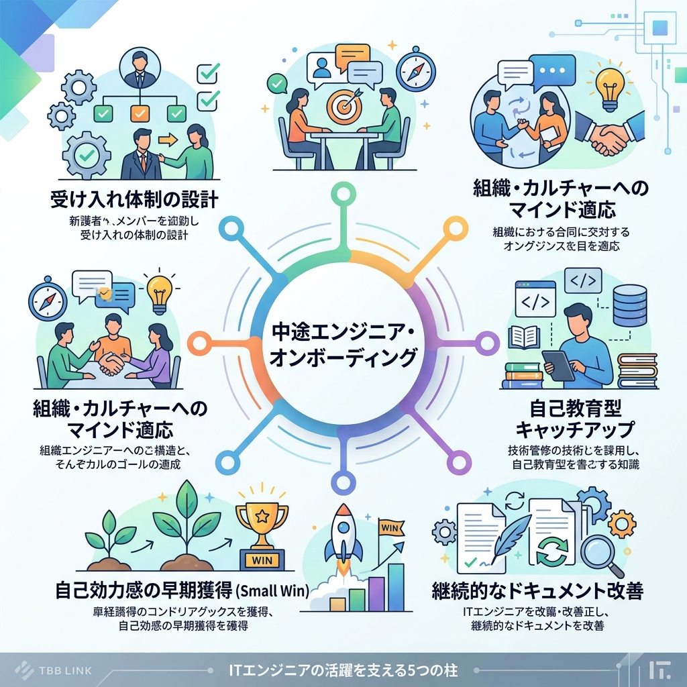

# 🗺️ ITエンジニア オンボーディング体系ガイド

本書は、参考書籍『オンボーディングの教科書』および国内IT企業（SmartHR、メルカリ、LINEヤフー、サイバーエージェント、DeNA、クラスメソッド）の事例、そして2026年最新のAI駆動開発者オンボーディングの動向に基づき、中途ITエンジニアをチームに迎える際のベストプラクティスを体系的に整理したガイドラインです。

---

## 📚 参考情報ソースへのリンク

本ガイドラインは、以下の各調査記録から得られたプラクティスを体系化したものです。

*   **書籍理論**: [📖 オンボーディングの教科書](ref_book_onboarding_guide.md)
*   **AI駆動オンボーディング**: [🤖 AIを活用した開発者オンボーディング (2026年)](ref_ai_onboarding_2026.md)
*   **企業事例**:
    *   [🏢 SmartHRの事例](ref_company_smarthr.md) (バリュー体現・セルフオンボーディングToDo)
    *   [🏢 メルカリの事例](ref_company_mercari.md) (オンボーディングポータル・Onboarding Quest)
    *   [🏢 LINEヤフーの事例](ref_company_line_yahoo.md) (受け入れ側のサポート・外部学習リソースの提供)
    *   [🏢 サイバーエージェントの事例](ref_company_cyberagent.md) (同期コミュニティの形成・半年間の長期伴走)
    *   [🏢 DeNAの事例](ref_company_dena.md) (中途共通プログラムDOP・人事と現場の連携)
    *   [🏢 クラスメソッドの事例](ref_company_classmethod.md) (個別最適なセルフオンボーディングシートの運用)

---

## 🏛️ 中途ITエンジニア オンボーディングの5つの柱

中途採用では新卒採用と異なり、新入社員はすでに他の組織での開発経験（＝独自の開発習慣）を持っています。そのため、単なる「スキルの習得」だけでなく、**「前職の習慣のアンラーニング」「新たな組織カルチャーへのマインド適応」「個別のスキル差分の効率的な埋め合わせ」**が必要となります。

チームが中途エンジニアを迎え入れる際は、以下の「5つの柱」に沿ってプログラムを構築します。

---

## 👥 柱①：組織の受け入れ体制と役割設計 (体制)

オンボーディングの失敗は、受け入れチームの準備不足や、一部のトレーナー（OJT担当者）への負荷集中によって発生します。これを防ぐため、組織的・協調的な受け入れ体制を設計します。

### 1. 現場（技術）と人事/HR（心理・マインド）の明確な役割分担
現場のトレーナーが新メンバーのケアをすべて背負うと、通常業務に支障が出ます。そのため、サポートの役割を分離します。
*   **新入社員トレーナー (現場)**: 技術・業務・開発環境の適応を直接サポートします (参照: [DeNAの事例](ref_company_dena.md), [書籍](ref_book_onboarding_guide.md))。
*   **新入社員メンター (現場/他チーム)**: 業務とは関係のない心理面、日常の雑談、社内ルールを案内します (参照: [DeNAの事例](ref_company_dena.md), [書籍](ref_book_onboarding_guide.md))。
*   **HR/人事担当 (全社)**: 組織への適応状況のモニタリング、定期アンケートの実施、期待値調整などの「マインド面」の伴走を担い、現場の精神的負担を軽減します (参照: [DeNAの事例](ref_company_dena.md))。

*   **受け入れサポート体制**: オンボーディング管理者（HR担当）が全体を統括しつつ、現場のトレーナーとメンターがそれぞれの役割で新メンバーを多角的にサポートする体制を構築します。

### 2. 受け入れ側（トレーナー・OJT担当者）の育成
「優秀なエンジニアだから受け入れができる」とは限りません。受け入れ側にも以下のトレーニングを提供し、サポート水準を一定に保ちます (参照: [LINEヤフーの事例](ref_company_line_yahoo.md))。
*   新メンバーへの「期待値」の明文化ルール。
*   5段階のサポートレベルの運用法。
*   フィードバックの行い方（4Aモデル等）。

### 3. 組織開発専任ロールの配置
エンジニア組織内にオンボーディングプログラムの最適化や、チーム間の受け入れプロセス標準化を担う「専任の役割（テクニカルリードやDevEx担当）」を配置し、プログラムを定常的に改善する体制を作ります (参照: [サイバーエージェントの事例](ref_company_cyberagent.md))。

---

## 📅 柱②：5大フェーズタイムラインと「マインド適応」

中途入社エンジニアのオンボーディングは、入社前から約3〜6ヶ月のタイムラインを意識して設計し、単なるスキル習得から「組織・カルチャーの深い理解」へと段階的に進めます。

### 1. 5大フェーズのスケジュール

*   **事前準備期 (〜Day 0)**: アカウント申請、PC発送など、初日から開発に参加できる環境を整えます。
*   **集中インプット期 (Day 1〜Week 1)**: PCセットアップ、カルチャー・バリュー研修への参加 (参照: [SmartHRの事例](ref_company_smarthr.md))、最初の小さなタスク（ファーストPR）のクローズ。
*   **業務適応期 (Week 2〜Month 1)**: 開発プロセスに慣れ、チーム外との「横のつながり」を築く (参照: [サイバーエージェントの事例](ref_company_cyberagent.md))。外部学習による技術補完 (参照: [LINEヤフーの事例](ref_company_line_yahoo.md))。
*   **自走準備期 (Month 2〜Month 3)**: メインタスクでの設計・実装・デプロイまでを単独（またはAIサポート）でやりきる。
*   **定着フォロー期 (Month 3〜Month 6)**: 入社3ヶ月後、半年後の節目での人事・マネージャーとの期待値すり合わせ面談の実施 (参照: [サイバーエージェントの事例](ref_company_cyberagent.md))。

### 2. カルチャーのアンラーニングと事業理解
中途メンバーが前職のやり方に囚われず、自律的に動けるようにするアプローチです。
*   **アンラーニングの促進**: 新しいチームが最も大切にするバリューや意思決定プロセスを初期に意識的に学び、前職と新チームのルールの違いをすり合わせます (参照: [SmartHRの事例](ref_company_smarthr.md))。
*   **事業・経営理解（視座の獲得）**: 単に目の前のコードを書くだけでなく、会社の全体事業ロードマップや製品価値について学ぶ共通プログラムを体験させ、「なぜそのコードを書くのか」のビジネスコンテキストを理解させます (参照: [DeNAの事例](ref_company_dena.md))。

---

## 🛠️ 柱③：自己教育型キャッチアップ (個別最適化 & AI活用)

中途入社者のスキルや経験は多様であるため、全員に一律の研修を提供するのは非効率です。新メンバーが自分のペースで、不足している知識を「自律的に埋める」仕組みを作ります。

*   **セルフオンボーディングシート**で学習の進捗を可視化し (参照: [クラスメソッドの事例](ref_company_classmethod.md))、**ハードスキルマップ**に基づいて不足している要素を特定します。その上で、**外部学習教材（Udemy/O'Reilly）** (参照: [LINEヤフーの事例](ref_company_line_yahoo.md)) や**Context-Aware AI（Cursor/Greptile）**を活用し、自分のペースで効率的にキャッチアップを進めます。

### 1. 個別化されたセルフオンボーディングシートの運用
新メンバーは、入社時にキャッチアップ項目が網羅された「セルフオンボーディングシート」を受け取ります。
*   新メンバーは、自分の保有スキルと照らし合わせ、既に知っているツールや技術のセクションをスキップしたり、逆に深く学習すべきセクションのペースを自分で調整したりします (参照: [クラスメソッドの事例](ref_company_classmethod.md))。

### 2. 外部学習リソースの提供によるスキル補完
チームの技術スタックと新メンバーの経験の間にギャップがある場合、トレーナーが講義をするのではなく、**Udemy Business** や **O'Reilly Online Learning** などの無償アカウントを提供し、新メンバーが効率的に独学できる環境を担保します (参照: [LINEヤフーの事例](ref_company_line_yahoo.md))。

---

## 🤖 柱④：AIを活用した自律キャッチアップの仕組み化（2026年最新トレンド）

2026年における最も効果的なエンジニアオンボーディングは、AIを新メンバーの**「常に傍にいる家庭教師」**として配備することです (参照: [AI駆動オンボーディング](ref_ai_onboarding_2026.md))。これにより、新メンバーの学習速度が飛躍的に向上するとともに、シニアエンジニアの拘束時間を約30%〜40%削減することが可能です。

### 1) Context-Aware AIによるコードベース理解
*   **ソースコードインデックス**: チームで開発している全リポジトリおよび社内ドキュメントを読み込ませたAIツール（CursorやGreptile等）を提供します。
*   **自律調査の推奨**: 新メンバーは「このAPIエンドポイントの処理の流れはどうなっているか？」「このモジュールが依存しているDBはどれか？」といった質問をAIに行い、レガシーコードの意味やデータフローを自ら能動的に解き明かします。

### 2) AIを教育的バディにする「プロンプト集」の提供
*   単にコードを生成させるのではなく、新メンバーが**学習目的**でAIを活用するためのプロンプトのテンプレートをワーキングアグリーメント等に用意します。
    *   *プロンプト例*: 「このコードブロックがなぜこのパターンで実装されているか、メリットとデメリットを3つ挙げてください」「このファイルをリファクタリングする場合、チームのコーディング規約に沿った改善案を提示してください」

### 3) AIによるSmall Win（初コミット）の支援
*   新メンバーが最初に書くテストコードの自動生成、Pull Requestの目的を説明する文章（PR description）の自動生成などにAI（Claude Code等）を使用させ、リリースフローの実行速度をサポートします。

### 4) Human-in-the-Loop（人間の関与）の境界線
*   AIによる効率化を重視しつつも、コード品質と深い理解を担保するため、以下の境界線を維持します。
    *   **AIができること**: 個別ファイルのコード解読、構文エラーの修正、テスト作成、APIリファレンスの要約。
    *   **人間（トレーナー）が関与すべきこと**: システム全体のアーキテクチャの妥当性レビュー、ドメイン固有のビジネスルールの理解、および期待されるアウトプットについての1on1でのフィードバック。

---

## 🚩 柱⑤：最速の自己効力感（Small Win）とOnboarding Quest

中途入社者は「早くチームに貢献しなければならない」というプレッシャー（焦り）を抱えがちです。初期の心理的安定を確保するため、早い段階で「成功体験」を提供します。

### 1. Day 1 Commit (入社初日のファーストマージ)
*   入社初日（または2日目）に、どんなに小さな変更（文言修正や簡単なバグ修正などの **Good First Issue**）でも構わないので、コードを書いてプルリクエストを出し、ステージングや本番へマージされる体験を設計します (参照: [Zenn/Qiitaの知見](ref_company_classmethod.md#早期アサイン))。
*   これにより、開発環境が完璧に構築できたという証明になると同時に、「初日から価値を提供できた」という強い自己効力感（Small Win）を新メンバーに与えることができます。

### 2. Onboarding Quest (クエストによるゲーミフィケーション)
*   単調なチェックリストをこなす作業を、ゲーム感覚で楽しむ「クエスト」形式に変換して運用します (参照: [メルカリの事例](ref_company_mercari.md))。
*   **クエスト例**:
    *   `Quest: 最初の変更をマージせよ` (Day 1 Commitの達成)
    *   `Quest: 隣のチームのTLとコーヒーを飲もう` (他部署のキーマンとの顔合わせ)
    *   `Quest: AIを使ってコードベースの全体図を要約し、Wikiにメモしよう` (AI活用とアウトプット体験)
*   進捗が可視化されることで、新メンバーはゲームを攻略するように主体的にオンボーディングを進められます。

---

## 🔄 柱⑥：ライブドキュメントとAIによる継続的改善

オンボーディングのコンテンツを常に新しく、高品質に保ち続けるための仕組みです。

### 1. 新メンバー自身によるドキュメント更新のルール化
*   オンボーディングドキュメント（セットアップ手順等）に古い記述や分かりにくい表現を見つけたら、**新メンバー自身がそれを修正するPRを出すこと**をオンボーディングの必須タスク（Quest）として定義します (参照: [書籍](ref_book_onboarding_guide.md))。
*   「ドキュメントが最新に保たれる」と同時に、新メンバーの「ドキュメントの改善によるチーム貢献」という達成感を生み出す好循環（ライブドキュメント）を作ります。

### 2. AIによるドキュメント維持管理のサポート
*   AIツールを活用して、ソースコードの変更履歴（コミットログ）から自動的にAPIドキュメントの陳腐化を検知したり、ドキュメントの自動アップデート・要約生成を行い、ドキュメントメンテナンスのコストを削減します (参照: [AI駆動オンボーディング](ref_ai_onboarding_2026.md))。
*   また、新メンバーがAIへ行った質問履歴を分析し、頻出する疑問点を自動的にFAQとしてドキュメントに蓄積します。

### 3. 5段階のサポートレベル
新メンバーが課題に直面した際、トレーナーは単に答えを教えるのではなく、状況に応じて以下の5段階のサポートを使い分け、段階的に自走を支援します (参照: [書籍](ref_book_onboarding_guide.md))。
*   **レベル1**: 答えを直接教える（環境構築や初期のドメイン知識）
*   **レベル2**: 解決のためのヒントや選択肢を示す
*   **レベル3**: 調査方法やドキュメントを提示する
*   **レベル4**: 問いかけを行い、新メンバー自身に考えさせる（プログラミングや設計の課題）
*   **レベル5**: 本人にすべて任せ、見守る（自走状態）
